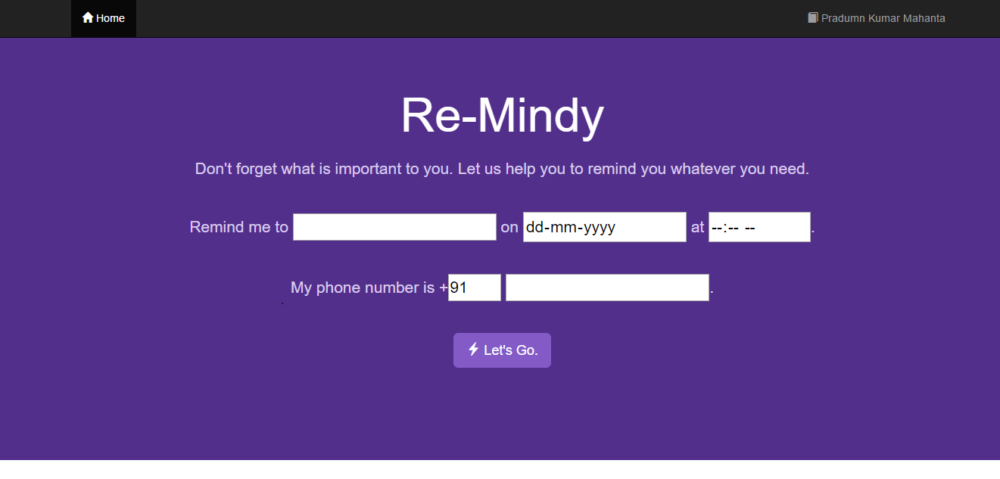
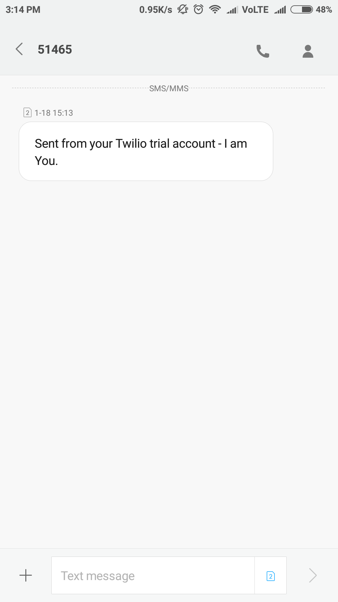

# What is this?
This is a simple implementation of <b>Twilio's</b> SMS API with Node.JS.
# How can I test this?
Head over to <a herf="https://re-mindy.herokuapp.com/">the deployed application</a>, to test it and explore its functionalities.
# Preview

Basic Web UI             |  Message
:-------------------------:|:-------------------------:
  |  
